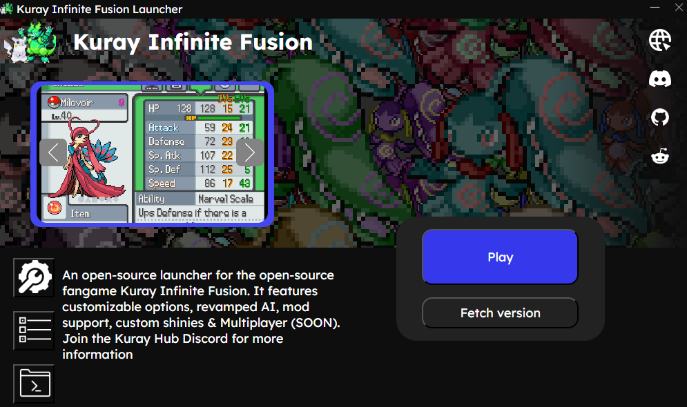
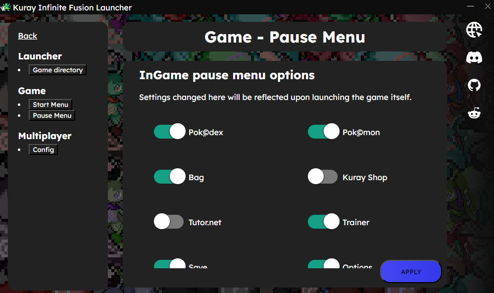
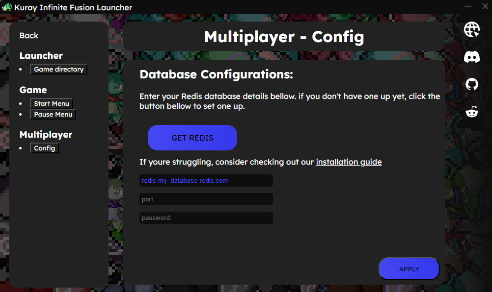

# Kuray Infinite Fusion Launcher

An easy-to-use launcher for [Kuray Infinite Fusion](https://github.com/kurayamiblackheart/kurayshinyrevamp).



This launcher attempts to simplify the process of installing and managing [Kuray Infinite Fusion](https://github.com/kurayamiblackheart/kurayshinyrevamp). It makes the installation process faster, simpler, and more user-friendly.

## How to install:

1. Head to the [releases tab](https://github.com/NoamRothschild/MultiplayerLauncher/releases) and download the latest "Kuray-Infinite-Fusion-Launcher.zip".
2. Extract the zip file and open **Kuray-Infinite-Fusion-Launcher.exe**.

If you see a Microsoft Defender SmartScreen warning when opening the app, follow these steps:
1. Click on "More info" in the warning dialog.
2. Click "Run anyway" to start the app.

The Microsoft Defender SmartScreen message appears because the app is not recognized by Microsoft's database and lacks a verified publisher. Do not worry — it’s safe to proceed.

## Features:

- Download and install Kuray Infinite Fusion
- Auto-Updates to the game's files
- Linking old game files instead of redownloading
- Open game folder
### Settings section includes
- Changing game directory
- Configure game's start menu buttons
- Configure game's pause menu buttons

- Configure multiplayer settings


### About Multiplayer
Multiplayer is currently not supported 100%. Features will be pushed after PIF's big update.

If you have git installed on your system and know how to use it & the CLI, you can run the following commands to get a pre-release of the system and link it as the game:
```bash
git init .
git remote add origin https://github.com/NoamRothschild/infinitefusionmultiplayer.git
git fetch origin release
git reset --hard origin/release
```

### Contribution / Building the project

**Note: This is a developer section. Information given here is not required or neccesary for getting the launcher to work**

The project runs on python & webview w/ flask. This means each time you launch the script it hosts a [flask server]() localy and using webview, creates a window using the default browser and renders the website.

The frontend is written in pure html, css & js.

Requirements:
- python 3.1 or above
- pip

<br>

```bash
pip install -r requirements.txt 
# ^^^ Installing dependencies

python3 main.py 
# ^^^ launching the application
```

### Building an executable (exe) file

For this step we would need an extra tool - pyinstaller
```bash
pip install pyinstaller
```
We would then run this to build out the file
```bash
pyinstaller --noconfirm --onedir --console --icon "path\to\this\project\icon.ico" --add-data "path\to\this\project\Frontend;Frontend/" --add-data "path\to\this\project\REQUIRED_BY_INSTALLER;REQUIRED_BY_INSTALLER/"  "path\to\this\project\main.py"
```

Make sure to replace `path\to\this\project\` with the correct path and change `--console` to `--windowed` for a build without the terminal.

# Have fun!

**For any help, please join the [Kuray Hub Discord](https://discord.com/invite/kuray-hub-1121345297352753243)**
